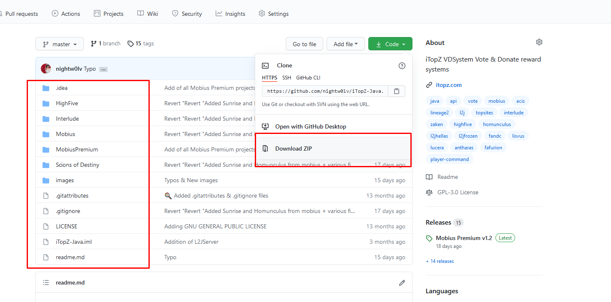
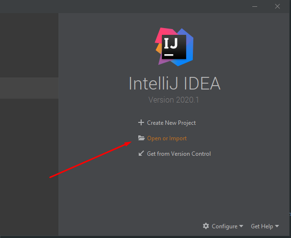
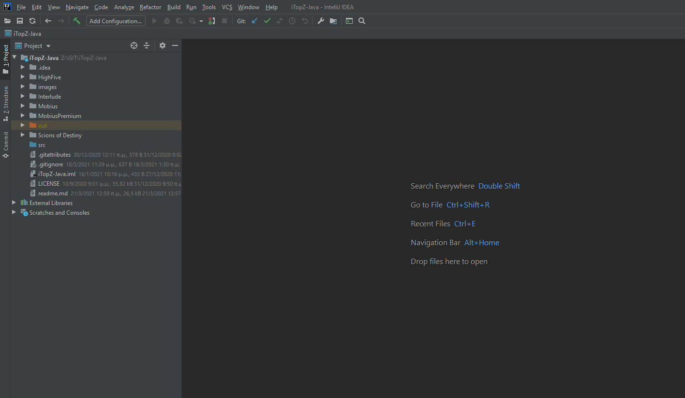
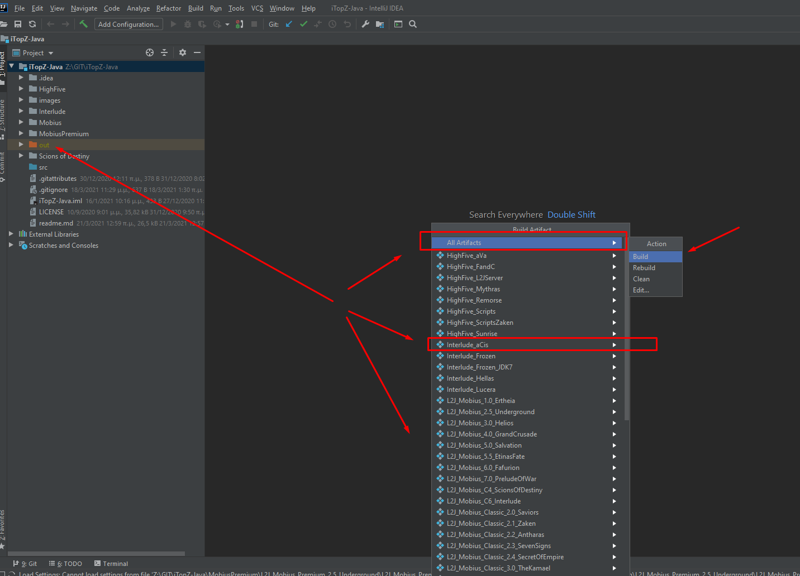
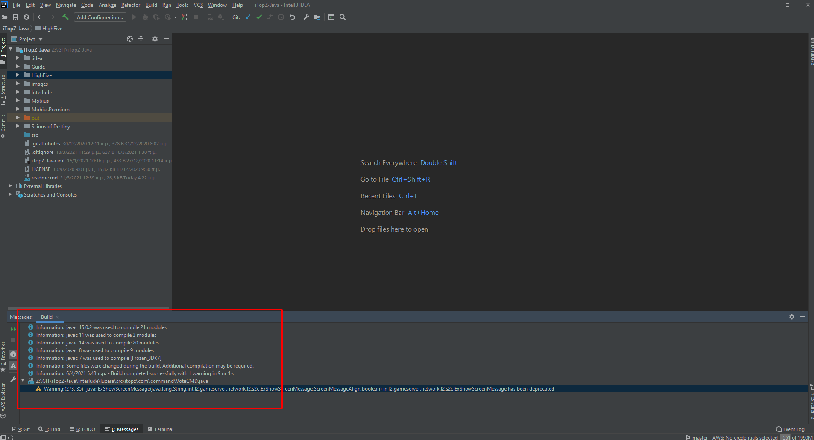
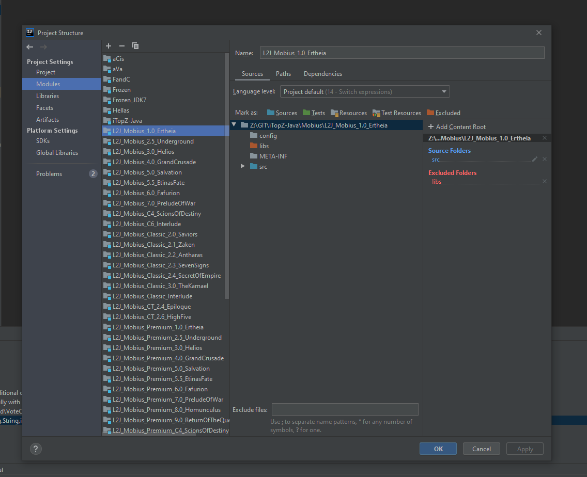
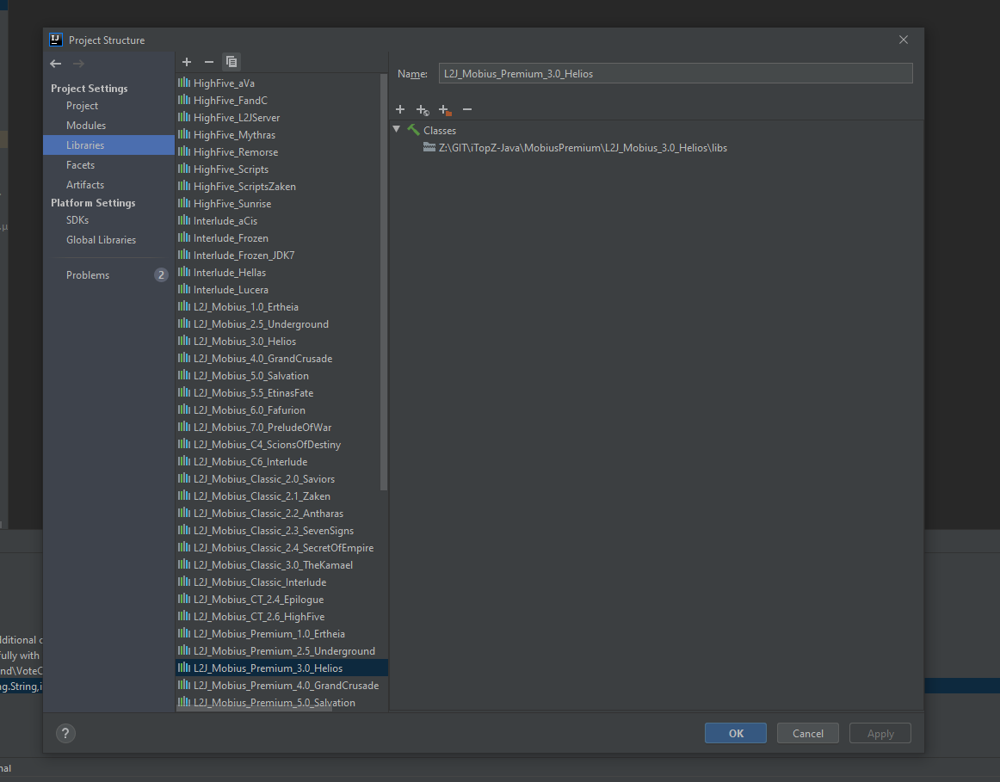
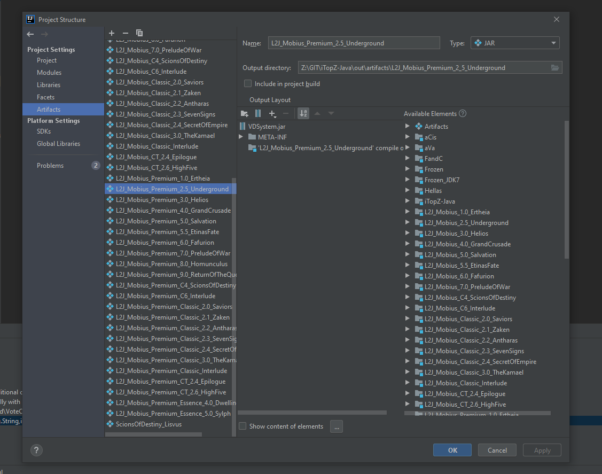
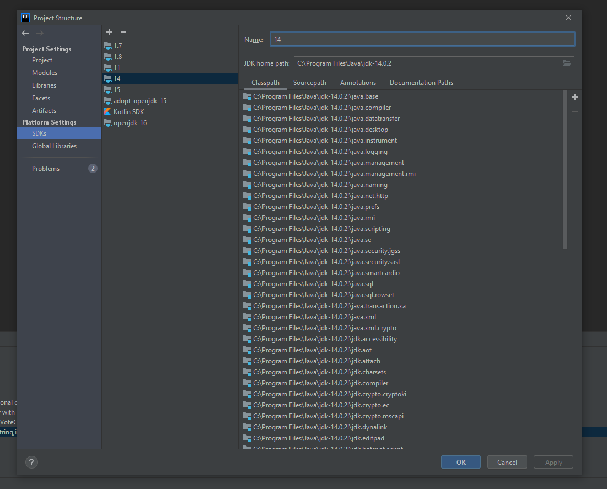
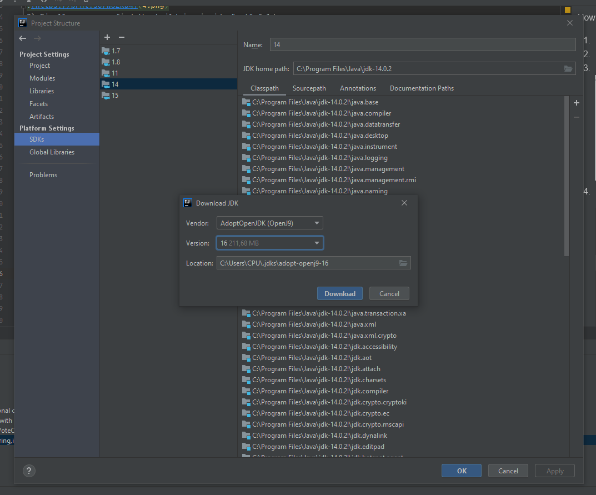

How to make your own sources and use them
1) Download and install intellij
2) Make a folder called iTopZ-Java
3) Download the sources like in image below

4) Open the folder with the extracted items

5) The files should look now like this

6) Select project and in top menu select Build and then Build artifacts

7) A new menu will open you can either build all or select the one you want

8) Finally, you can find the build jar inside "out" folder
9) Copy it on your sources usually on lib or libs folder inside eclipse
10) Right click on it -> add to class path
11) Go in your GameServer.java and somewhere call it as VDSystemManager.getInstance();
12) press ctrl+shift+o to import it and build your server

Notes
1) You can replace jars of any project with newer or older and try to apply the project on that jar
2) The VDSystem isn't require any project source only a l2jserver.jar file
3) A successful build look like this

4) Here you can see the installed modules

5) Here you can edit the l2jserver jar libraries

6) Here are the artifacts that consist the build function

7) Here you can see and verify the installed JDK versions or point out the already installed paths

8) You need to have installed and set on project the following JDK versions 1.7, 1.8, 11, 14, 15

9) Here are the vendors that you can download the JDK versions

That's it, you now can have your own build remove unnecessary projects.

Wanna help maintain and keep the project alive donate [here](https://paypal.me/top100) or
