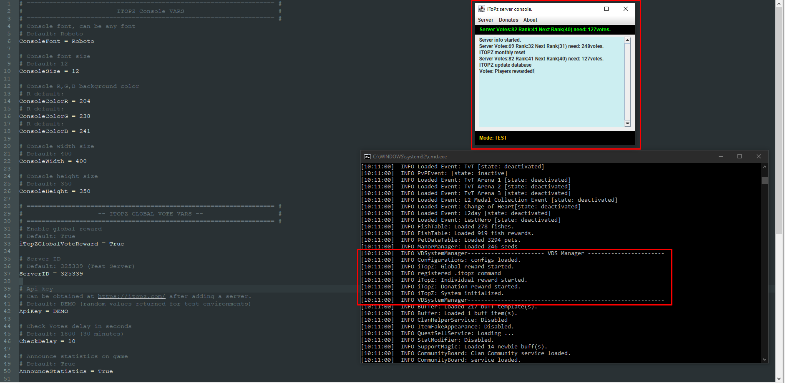
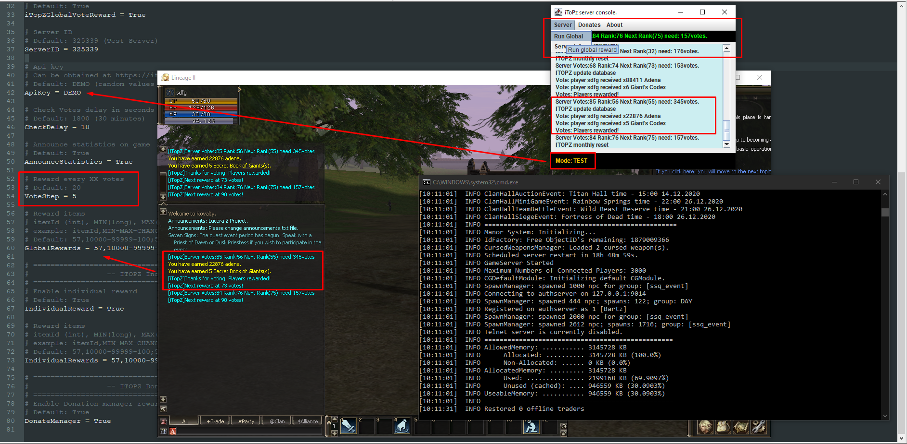

**VDS Vote Donate System**

Implementation of vote global and individual system with itopz donate panel task manager.
-
- Global vote reward is when players vote for the server in one of the topsites installed as a "thank you" they will receive configured item/items reward.
- Individual vote reward is when a single player (individual) vote for the server on one or more topsites and for each vote as a "thank you" he will receive configured item/items reward.

**Requirement**
- Mobius Premium Dwelling of Spirits
- Patch installation (provided)
- JDK 15

**Build**
- File ```VDSystem.jar```
- Version: 1.3

**Global vote system**

- IP restricted rewards
- Reward every XX minutes
- Reward step every XX votes
- Reward item list will check if item exist
- Reward item list with chances 0-100%
- Reward item randomized of min-max values
- Update console votes and ranking
- Save votes in case of restarting the server
- Monthly reset for votes
- Print response failure message
- Configured announcement print of server vote statistics

**Individual vote system**

- Automatically register .topsite command
- Reward item list will check if item exist
- Reward item list with chances 0-100%
- Reward item randomized of min-max values
- Reward will set as "expired" after 12hours checking server time
- Reward reuse 12hours
- Command used after reward will show remaining time (PM/AM) to vote again
- Check for local ips is restriction
- Check for response errors
- Check if player voted

**Donate Management** (upgrade version of [Donate Panel](https://github.com/nightw0lv/DonatePanel))

- Player donates through Donate Panel
- Item will be rewarded in game

**Configs**

- Fully configured Console
- Fully configured global reward
- Fully configured individual reward

**Console**

- Information buttons
- Can send global reward in-game manually
- Prints rewards
- Prints donates
- Prints monthly reset
- Prints database updates
- Shows server ranking statistics
- Auto scrolling messages
- Fully configured

**Installation**


```Special thanks to Rationale``` :cry:

**Images**





**Chancelog**

- Version 1.3
  - Rework on VoteCMD
    - Fixed possible concurrent error on response thread (Ty Rationale)
    - Using StatsSet to transfer data in method isEligible (Ty Rationale)
    - Introducing a Flood Protector (Ty Rationale)
    - Using "NONE" for default errors to avoid NPE
    - Thread Execute will run on random between 1 and 10 seconds to avoid cheats

- Version 1.1
  - Minimal Requirement on server resources and class consistency along projects.
    - Addition of Thread class.
    - Addition of Random class.
    - Addition of Logs class.
    - Addition of Url class.
    - Addition of Rewards class.
    - SQL independence on tables with vds_individual and vds_global tables automatic install by default
  - Addition of topsites and their configs.
    - Hopzone.
    - L2Network.
    - L2TopGameServer.
    - L2TopServers.
    - L2Votes.
    - L2JBrasil.
  - Gui
    - Addition of Debug on/off button.
    - Addition of Bug report button.
    - Removed Debug mode.
    - Rework on the class to update all topsite statistics.
    - Rework on console size and re-arrange information and console.
  - Fixed Bug that made global with individual rewards conflict.
  - Improved custom JSon parser for wannabe-called APIs on a lot of topsites.
  - Improved Debug with External IP Address.
  - Improved code style on some cases like enchanted switch on mobius projects.

- Version 1.0
  - Initial commit


 